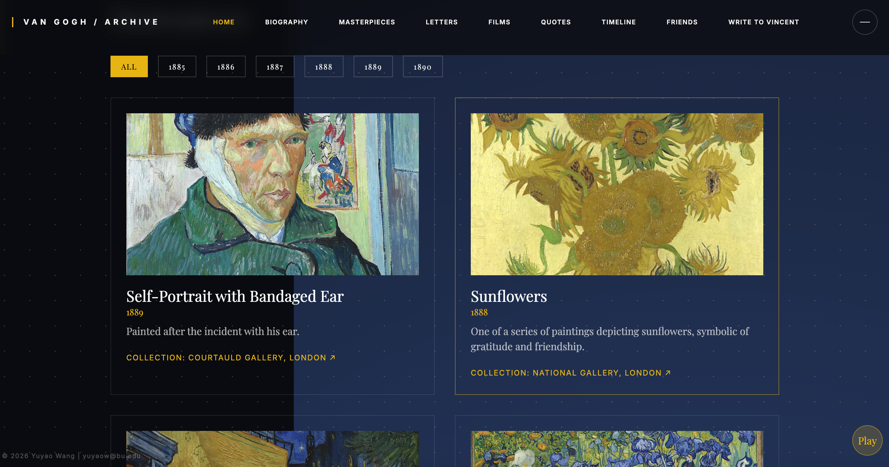

<div align="center">

# 🌻 Vincent's Archive

### *An Immersive Digital Sanctuary for Van Gogh's Legacy*

[](https://react.dev/)
[](https://www.typescriptlang.org/)
[](https://tailwindcss.com/)
[](https://vitejs.dev/)
[](https://vincent-cyan.vercel.app/)

[**🎨 Live Demo**](https://vincent-cyan.vercel.app/) · [**✨ Features**](#-features) · [**🛠 Tech Stack**](#%EF%B8%8F-tech-stack) · [**💌 Contact**](#-contact)


</div>

> *"I dream of painting and then I paint my dream."*
> — **Vincent van Gogh**

<br/>

## 🌌 About the Project

**Vincent's Archive** is an interactive React application crafted as a love letter to one of history's most beloved post-impressionist painters. Through atmospheric design, ambient music, and carefully curated content, it invites visitors into the turbulent yet profoundly beautiful world of Vincent van Gogh — a place where his paintings, letters, and quotes coalesce into a cohesive, emotive experience.

This archive is more than a portfolio of his works; it is a digital sanctuary that captures the spirit of his vision and the depth of his humanity.

<br/>

## ✨ Features

### 🎭 Immersive Hero Interface
A cinematic, split-screen home experience featuring high-resolution imagery of Van Gogh's iconic landscapes layered with atmospheric typography and gentle motion.

### 🎵 Ambient Soundscape
A built-in thematic audio experience ("Vincent") with a graceful fade-in to draw you fully into the atmosphere — toggle on or off at your discretion.

### 🖼️ Curated Masterpieces Gallery
A responsive gallery showcasing Van Gogh's most significant works, filterable by year, accompanied by contextual details and links to the world-class museum collections that house each piece today.

<div align="center">



</div>

### 📜 Living History
A constellation of dedicated sections that bring Vincent's world into focus:

| Section | Description |
|---|---|
| **Biography** | A narrative journey through Vincent's life |
| **Timeline** | Key moments and turning points |
| **Letters** | Excerpts from his profound correspondence with Theo |
| **Quotes** | Reflections on art, suffering, and beauty |
| **Friends** | The artists and souls who shaped his world |
| **Films** | Documentaries and cinematic tributes |

### ✉️ Write to Vincent
A reflective space inviting visitors to compose their own letters to Vincent — a quiet bridge across time.

<br/>

## 🛠️ Tech Stack

<div align="center">

| Layer | Technology |
|:---:|:---|
| 🧱 **Framework** | React 18+ |
| 🔤 **Language** | TypeScript |
| 🎨 **Styling** | Tailwind CSS |
| 🌀 **Animations** | `motion/react` (Framer Motion) |
| ⚡ **Build Tool** | Vite |
| ☁️ **Deployment** | Vercel |

</div>

<br/>

## 🚀 Getting Started

### Prerequisites
- **Node.js 18+** and a package manager (`npm`, `pnpm`, or `yarn`)

### Installation

```bash
# 1. Clone the repository
git clone https://github.com/<your-username>/vincents-archive.git
cd vincents-archive

# 2. Install dependencies
npm install

# 3. Start the development server
npm run dev
```

The app will be available at **`http://localhost:5173`**.

### Build for Production

```bash
npm run build      # Generate optimized production bundle
npm run preview    # Preview the production build locally
```

<br/>


## 🎨 Design Philosophy

This archive draws directly on Van Gogh's own visual vocabulary:

- 🌌 A **midnight palette** echoing *Starry Night* and *Starry Night Over the Rhône*
- 🌻 **Golden accents** reminiscent of his beloved sunflowers
- 📖 **Elegant serif typography** to honor the literary depth of his correspondence
- 🌀 **Atmospheric motion** evoking the swirling brushstrokes of his late work

Every detail — from the quiet hover states to the slow audio fade — is shaped to feel less like a website, and more like stepping into a memory.

<br/>

## 📜 License

This is a personal archival project created with reverence for Vincent's legacy and the public-domain works of art it celebrates. All paintings shown are in the public domain; site code is provided for personal and educational reference.

<br/>

## 💌 Contact

<div align="center">

**Curated & Developed by Yuyao Wang**

[](mailto:yuyaow@bu.edu)
[](https://vincent-cyan.vercel.app/)

<br/>

*© Yuyao Wang · Made with 🌻 in honor of Vincent*

</div>
